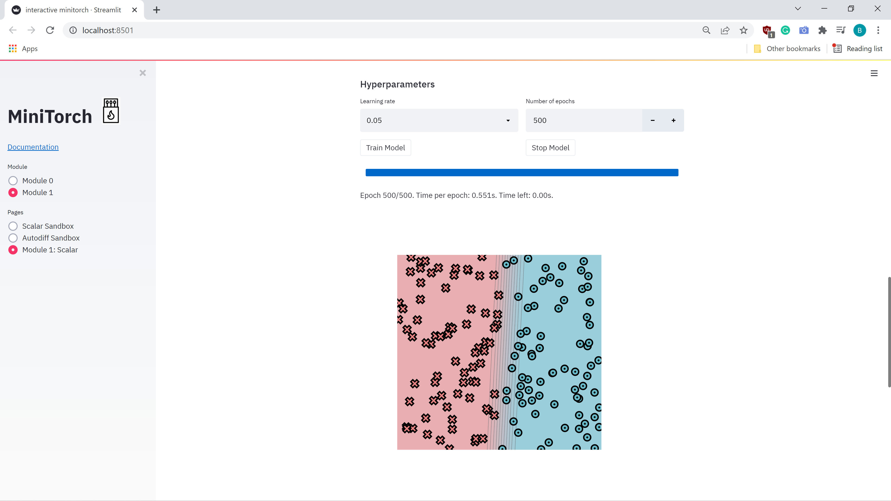
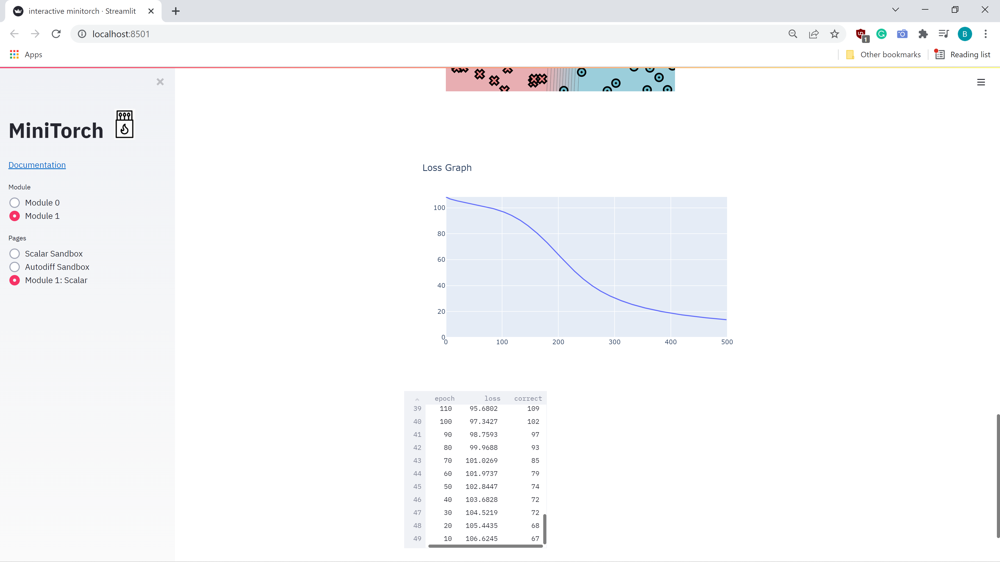
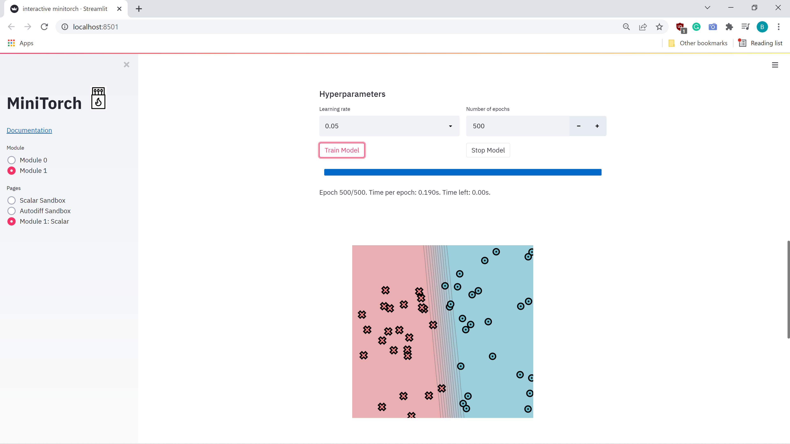
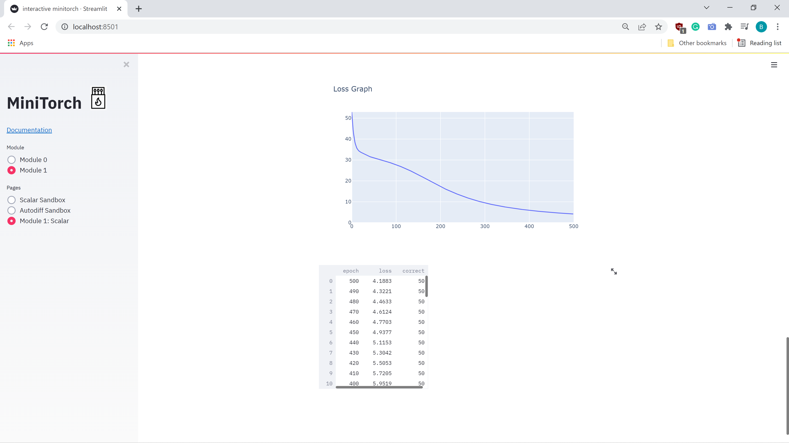
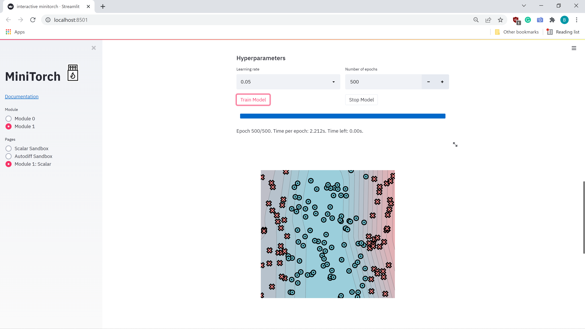
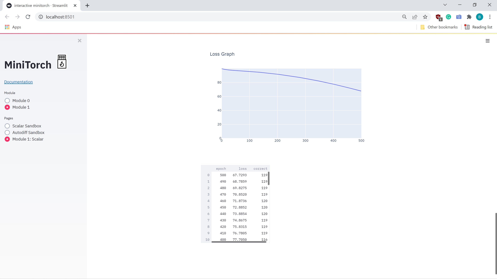
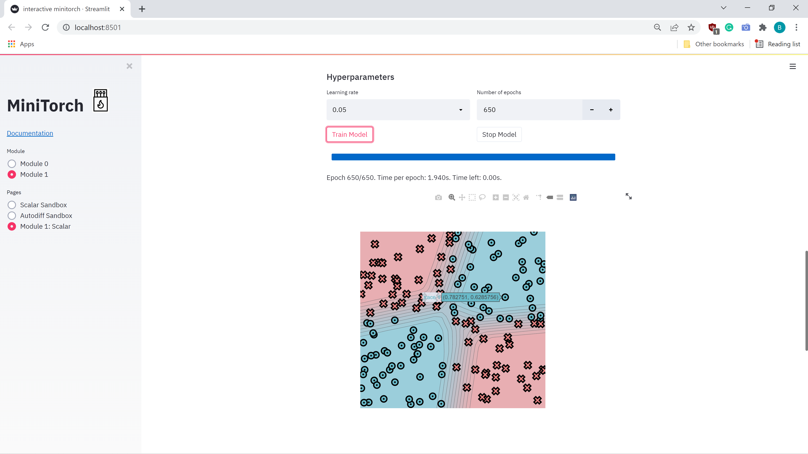

# MiniTorch Module 1

* Docs: https://minitorch.github.io/

* Overview: https://minitorch.github.io/module1.html

This assignment requires the following files from the previous assignments.

        minitorch/operators.py minitorch/module.py tests/test_module.py tests/test_operators.py project/run_manual.py

The outputs of the traning model:

1) The output for "Simple" traning dataset. The number of hidden layers=5, learning rate-0.05, Number of epochs=500, Number of points in datasets=150.

The output logs:

Epoch: 0/500, loss: 0, correct: 0 
Epoch: 0/500, loss: 0, correct: 0 
Epoch: 0/500, loss: 0, correct: 0 
Epoch: 0/500, loss: 0, correct: 0 
Epoch: 10/500, loss: 106.62451530912844, correct: 67 
Epoch: 20/500, loss: 105.44352132800726, correct: 68 
Epoch: 30/500, loss: 104.52190072540881, correct: 72 
Epoch: 40/500, loss: 103.68281381204173, correct: 72 
Epoch: 50/500, loss: 102.84471189675044, correct: 74 
Epoch: 60/500, loss: 101.97373834564385, correct: 79 
Epoch: 70/500, loss: 101.02686691936614, correct: 85 
Epoch: 80/500, loss: 99.96880518241049, correct: 93 
Epoch: 90/500, loss: 98.75925313032513, correct: 97 
Epoch: 100/500, loss: 97.34274222747563, correct: 102 
Epoch: 110/500, loss: 95.68019382810779, correct: 109 
Epoch: 120/500, loss: 93.64654949132789, correct: 113 
Epoch: 130/500, loss: 91.25030062647825, correct: 118 
Epoch: 140/500, loss: 88.41209670522134, correct: 122 
Epoch: 150/500, loss: 85.17316674779111, correct: 125 
Epoch: 160/500, loss: 81.60534916942225, correct: 129 
Epoch: 170/500, loss: 77.7276046401297, correct: 131 
Epoch: 180/500, loss: 73.53188816314511, correct: 135 
Epoch: 190/500, loss: 69.02956161845995, correct: 135 
Epoch: 200/500, loss: 64.40624429412264, correct: 135 
Epoch: 210/500, loss: 59.77448847060212, correct: 137 
Epoch: 220/500, loss: 55.27242111363723, correct: 138 
Epoch: 230/500, loss: 51.01164918074585, correct: 142 
Epoch: 240/500, loss: 47.08129110720959, correct: 142 
Epoch: 250/500, loss: 43.48480347583227, correct: 145 
Epoch: 260/500, loss: 40.25902414746249, correct: 145 
Epoch: 270/500, loss: 37.390063949497794, correct: 145 
Epoch: 280/500, loss: 34.84913971513392, correct: 146 
Epoch: 290/500, loss: 32.606154420477125, correct: 147 
Epoch: 300/500, loss: 30.614886634817534, correct: 148 
Epoch: 310/500, loss: 28.833661449235613, correct: 148 
Epoch: 320/500, loss: 27.23026540562683, correct: 149 
Epoch: 330/500, loss: 25.79071300766173, correct: 149 
Epoch: 340/500, loss: 24.490654213802614, correct: 150 
Epoch: 350/500, loss: 23.31333066099989, correct: 150 
Epoch: 360/500, loss: 22.245345638911356, correct: 150 
Epoch: 370/500, loss: 21.27216618383416, correct: 150 
Epoch: 380/500, loss: 20.38079770912301, correct: 150 
Epoch: 390/500, loss: 19.56236992851369, correct: 150 
Epoch: 400/500, loss: 18.808835120931583, correct: 150 
Epoch: 410/500, loss: 18.115446420479152, correct: 150 
Epoch: 420/500, loss: 17.47439158137093, correct: 150 
Epoch: 430/500, loss: 16.88068262323232, correct: 150 
Epoch: 440/500, loss: 16.32829624720292, correct: 150 
Epoch: 450/500, loss: 15.813167050886458, correct: 150 
Epoch: 460/500, loss: 15.331974587284918, correct: 150 
Epoch: 470/500, loss: 14.88257910813326, correct: 150 
Epoch: 480/500, loss: 14.460903819252536, correct: 150 
Epoch: 490/500, loss: 14.06381929690576, correct: 150 
Epoch: 500/500, loss: 13.690047334122825, correct: 150 

The visual form of training:

The loss graph of simple model:

2) The output for "Diag" traning dataset. The number of hidden layers=5, learning rate-0.05, Number of epochs=500, Number of points in dataset=50.
The output logs:

Epoch: 0/500, loss: 0, correct: 0 
Epoch: 0/500, loss: 0, correct: 0 
Epoch: 10/500, loss: 36.99113306334488, correct: 26 
Epoch: 20/500, loss: 33.864853699631304, correct: 26 
Epoch: 30/500, loss: 32.74700331872638, correct: 26 
Epoch: 40/500, loss: 31.74887065107825, correct: 26 
Epoch: 50/500, loss: 31.013386746834527, correct: 34 
Epoch: 60/500, loss: 30.425568702920547, correct: 37 
Epoch: 70/500, loss: 29.836338036470252, correct: 37 
Epoch: 80/500, loss: 29.208971997143575, correct: 39 
Epoch: 90/500, loss: 28.53103861722197, correct: 40 
Epoch: 100/500, loss: 27.786969807548367, correct: 41 
Epoch: 110/500, loss: 26.97363860771236, correct: 41 
Epoch: 120/500, loss: 26.08954655273748, correct: 42 
Epoch: 130/500, loss: 25.135447425672382, correct: 43 
Epoch: 140/500, loss: 24.11503747071245, correct: 43 
Epoch: 150/500, loss: 23.03555301895181, correct: 43 
Epoch: 160/500, loss: 21.909105257332627, correct: 43 
Epoch: 170/500, loss: 20.755872030063678, correct: 44 
Epoch: 180/500, loss: 19.60341606059112, correct: 46 
Epoch: 190/500, loss: 18.46718125226831, correct: 47 
Epoch: 200/500, loss: 17.365497978440054, correct: 49 
Epoch: 210/500, loss: 16.321269308128453, correct: 49 
Epoch: 220/500, loss: 15.346599592070907, correct: 50 
Epoch: 230/500, loss: 14.431680115538393, correct: 50 
Epoch: 240/500, loss: 13.572933171524499, correct: 50 
Epoch: 250/500, loss: 12.766739838363035, correct: 50 
Epoch: 260/500, loss: 12.016317209225122, correct: 50 
Epoch: 270/500, loss: 11.316204361276993, correct: 50 
Epoch: 280/500, loss: 10.667978660210817, correct: 50 
Epoch: 290/500, loss: 10.076074537206276, correct: 50 
Epoch: 300/500, loss: 9.5279099585802, correct: 50 
Epoch: 310/500, loss: 9.032469633054133, correct: 50 
Epoch: 320/500, loss: 8.575702001412951, correct: 50 
Epoch: 330/500, loss: 8.154711337456442, correct: 50 
Epoch: 340/500, loss: 7.766732062213295, correct: 50 
Epoch: 350/500, loss: 7.406067928922699, correct: 50 
Epoch: 360/500, loss: 7.070698611138966, correct: 50 
Epoch: 370/500, loss: 6.759044971000457, correct: 50 
Epoch: 380/500, loss: 6.469809056145523, correct: 50 
Epoch: 390/500, loss: 6.201090617793248, correct: 50 
Epoch: 400/500, loss: 5.951907599086273, correct: 50 
Epoch: 410/500, loss: 5.720534352310649, correct: 50 
Epoch: 420/500, loss: 5.505345530091424, correct: 50 
Epoch: 430/500, loss: 5.304207591377976, correct: 50 
Epoch: 440/500, loss: 5.115317298673823, correct: 50 
Epoch: 450/500, loss: 4.937658677173859, correct: 50 
Epoch: 460/500, loss: 4.7703123646582215, correct: 50 
Epoch: 470/500, loss: 4.612446150824427, correct: 50 
Epoch: 480/500, loss: 4.463286154171158, correct: 50 
Epoch: 490/500, loss: 4.322058792134242, correct: 50 
Epoch: 500/500, loss: 4.188280353268316, correct: 50 

The visual form of training:

The loss graph of simple model:

3) The output for "Split" traning dataset. The number of hidden layers=10, learning rate-0.05, Number of epochs=500, Number of points in dataset=150.
The output logs:

Epoch: 0/500, loss: 0, correct: 0 
Epoch: 0/500, loss: 0, correct: 0 
Epoch: 0/500, loss: 0, correct: 0 
Epoch: 0/500, loss: 0, correct: 0 
Epoch: 0/500, loss: 0, correct: 0 
Epoch: 0/500, loss: 0, correct: 0 
Epoch: 10/500, loss: 98.90786339262172, correct: 90 
Epoch: 20/500, loss: 98.26900584537765, correct: 90 
Epoch: 30/500, loss: 97.76916421500042, correct: 90 
Epoch: 40/500, loss: 97.4305376153011, correct: 90 
Epoch: 50/500, loss: 97.1430095936355, correct: 90 
Epoch: 60/500, loss: 96.8736820757265, correct: 90 
Epoch: 70/500, loss: 96.62900041404377, correct: 90 
Epoch: 80/500, loss: 96.38315624591093, correct: 90 
Epoch: 90/500, loss: 96.12970431021174, correct: 92 
Epoch: 100/500, loss: 95.86351490205071, correct: 92 
Epoch: 110/500, loss: 95.59093277282895, correct: 93 
Epoch: 120/500, loss: 95.2721641734268, correct: 93 
Epoch: 130/500, loss: 94.90379162884751, correct: 93 
Epoch: 140/500, loss: 94.4988748446931, correct: 93 
Epoch: 150/500, loss: 94.11329900555502, correct: 93 
Epoch: 160/500, loss: 93.71719796548768, correct: 95 
Epoch: 170/500, loss: 93.30235953273264, correct: 97 
Epoch: 180/500, loss: 92.88810719477999, correct: 98 
Epoch: 190/500, loss: 92.42977468464733, correct: 103 
Epoch: 200/500, loss: 91.90970316585911, correct: 103 
Epoch: 210/500, loss: 91.35520591854149, correct: 105 
Epoch: 220/500, loss: 90.8016823033826, correct: 105 
Epoch: 230/500, loss: 90.24773777788435, correct: 105 
Epoch: 240/500, loss: 89.67757466416819, correct: 105 
Epoch: 250/500, loss: 89.09476865798968, correct: 106 
Epoch: 260/500, loss: 88.49766140378915, correct: 108 
Epoch: 270/500, loss: 87.87295761589691, correct: 109 
Epoch: 280/500, loss: 87.21710689113311, correct: 109 
Epoch: 290/500, loss: 86.52624275188163, correct: 109 
Epoch: 300/500, loss: 85.81512238117395, correct: 109 
Epoch: 310/500, loss: 85.0861958983543, correct: 110 
Epoch: 320/500, loss: 84.33735862196579, correct: 111 
Epoch: 330/500, loss: 83.5696096956906, correct: 111 
Epoch: 340/500, loss: 82.79614565483084, correct: 113 
Epoch: 350/500, loss: 82.00234921974685, correct: 114 
Epoch: 360/500, loss: 81.19149203649802, correct: 115 
Epoch: 370/500, loss: 80.36313275135852, correct: 115 
Epoch: 380/500, loss: 79.49635911519026, correct: 116 
Epoch: 390/500, loss: 78.60927818298323, correct: 116 
Epoch: 400/500, loss: 77.70503046863959, correct: 116 
Epoch: 410/500, loss: 76.7804596714731, correct: 119 
Epoch: 420/500, loss: 75.83150777172938, correct: 119 
Epoch: 430/500, loss: 74.86748407427895, correct: 119 
Epoch: 440/500, loss: 73.8854397193546, correct: 120 
Epoch: 450/500, loss: 72.88519103298918, correct: 120 
Epoch: 460/500, loss: 71.8736179267887, correct: 120 
Epoch: 470/500, loss: 70.85198703664003, correct: 119 
Epoch: 480/500, loss: 69.8275183152187, correct: 119 
Epoch: 490/500, loss: 68.78594462209486, correct: 119 
Epoch: 500/500, loss: 67.72928426362034, correct: 119 

The visual form of training:

The loss graph of simple model:

4) The output for "Xor" traning dataset. The number of hidden layers=10, learning rate-0.05, Number of epochs=650, Number of points in dataset=150.
The output logs:

Epoch: 0/500, loss: 0, correct: 0 
Epoch: 0/500, loss: 0, correct: 0 
Epoch: 10/650, loss: 99.6795278091859, correct: 86 
Epoch: 20/650, loss: 96.19365073355138, correct: 99 
Epoch: 30/650, loss: 94.64183104778758, correct: 101 
Epoch: 40/650, loss: 93.51156291433584, correct: 101 
Epoch: 50/650, loss: 92.55479472731594, correct: 101 
Epoch: 60/650, loss: 91.58186940080053, correct: 104 
Epoch: 70/650, loss: 90.50986037394634, correct: 104 
Epoch: 80/650, loss: 89.47725558221642, correct: 104 
Epoch: 90/650, loss: 88.43208215933737, correct: 104 
Epoch: 100/650, loss: 87.40333222659208, correct: 105 
Epoch: 110/650, loss: 86.2785442269747, correct: 105 
Epoch: 120/650, loss: 85.049030589544, correct: 110 
Epoch: 130/650, loss: 83.83931991594626, correct: 114 
Epoch: 140/650, loss: 82.75674294202283, correct: 116 
Epoch: 150/650, loss: 81.68034647991831, correct: 117 
Epoch: 160/650, loss: 80.56469018376407, correct: 119 
Epoch: 170/650, loss: 79.42290619378458, correct: 120 
Epoch: 180/650, loss: 78.24436793437803, correct: 121 
Epoch: 190/650, loss: 76.99127645082234, correct: 121 
Epoch: 200/650, loss: 75.70107402848443, correct: 123 
Epoch: 210/650, loss: 74.26123044078412, correct: 124 
Epoch: 220/650, loss: 72.92472981236715, correct: 125 
Epoch: 230/650, loss: 71.62712045702843, correct: 125 
Epoch: 240/650, loss: 70.33470345524304, correct: 126 
Epoch: 250/650, loss: 69.0533812600635, correct: 128 
Epoch: 260/650, loss: 67.77609960720629, correct: 128 
Epoch: 270/650, loss: 66.5087691688666, correct: 128 
Epoch: 280/650, loss: 65.25449378496447, correct: 132 
Epoch: 290/650, loss: 64.0248096626371, correct: 134 
Epoch: 300/650, loss: 62.80941651210364, correct: 134 
Epoch: 310/650, loss: 61.61527305090068, correct: 135 
Epoch: 320/650, loss: 60.44930233030921, correct: 135 
Epoch: 330/650, loss: 59.30571824735504, correct: 134 
Epoch: 340/650, loss: 58.182914170823025, correct: 133 
Epoch: 350/650, loss: 57.08346959967269, correct: 133 
Epoch: 360/650, loss: 56.009580250345316, correct: 133 
Epoch: 370/650, loss: 54.961997257191044, correct: 133 
Epoch: 380/650, loss: 53.942709512337, correct: 134 
Epoch: 390/650, loss: 52.949917910530495, correct: 134 
Epoch: 400/650, loss: 51.984675000147966, correct: 134 
Epoch: 410/650, loss: 51.04782767975109, correct: 134 
Epoch: 420/650, loss: 50.14012939525619, correct: 136 
Epoch: 430/650, loss: 49.2597774066441, correct: 136 
Epoch: 440/650, loss: 48.40596762767255, correct: 136 
Epoch: 450/650, loss: 47.580095226014414, correct: 136 
Epoch: 460/650, loss: 46.780201192686604, correct: 136 
Epoch: 470/650, loss: 46.004843408838475, correct: 136 
Epoch: 480/650, loss: 45.25150870987128, correct: 137 
Epoch: 490/650, loss: 44.52098685321134, correct: 137 
Epoch: 500/650, loss: 43.81185721937863, correct: 139 
Epoch: 510/650, loss: 43.12379398213885, correct: 139 
Epoch: 520/650, loss: 42.45486761431188, correct: 139 
Epoch: 530/650, loss: 41.80420016616687, correct: 139 
Epoch: 540/650, loss: 41.17146767776599, correct: 139 
Epoch: 550/650, loss: 40.55512862669141, correct: 139 
Epoch: 560/650, loss: 39.95542286786433, correct: 140 
Epoch: 570/650, loss: 39.37167385478003, correct: 140 
Epoch: 580/650, loss: 38.803144246815094, correct: 140 
Epoch: 590/650, loss: 38.24839536683513, correct: 140 
Epoch: 600/650, loss: 37.70820882561401, correct: 140 
Epoch: 610/650, loss: 37.18093427498736, correct: 140 
Epoch: 620/650, loss: 36.667500859708916, correct: 141 
Epoch: 630/650, loss: 36.165213300427865, correct: 141 
Epoch: 640/650, loss: 35.676356311094125, correct: 142 
Epoch: 650/650, loss: 35.19840289244849, correct: 142 

The visual form of training:

The loss graph of simple model:
