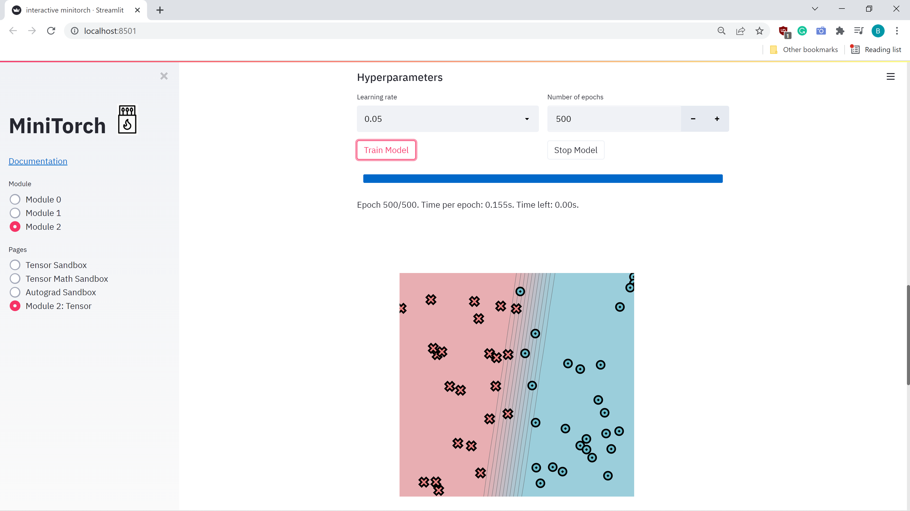
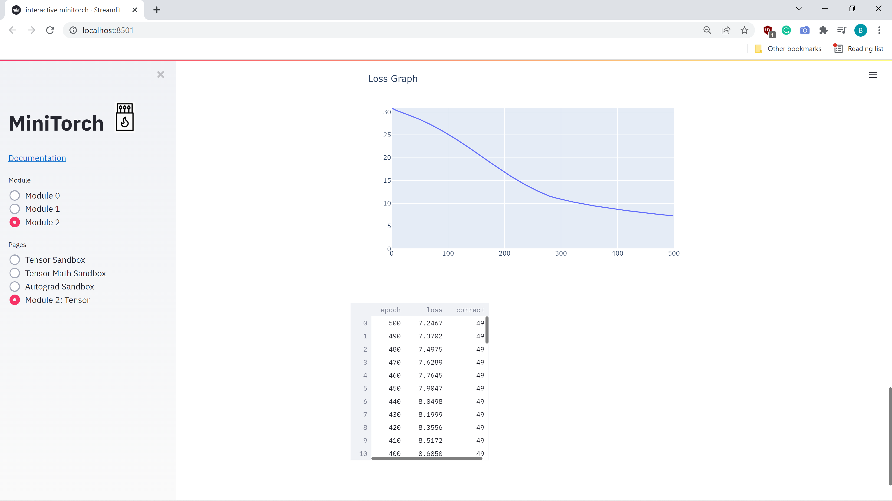
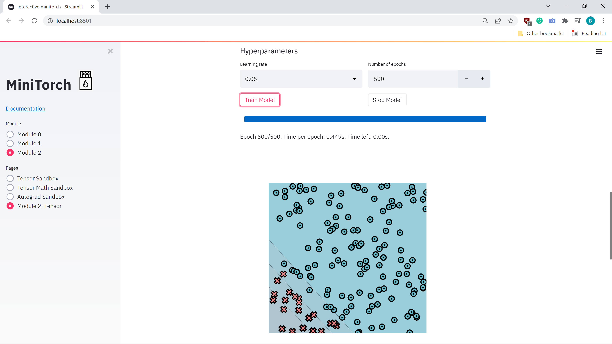
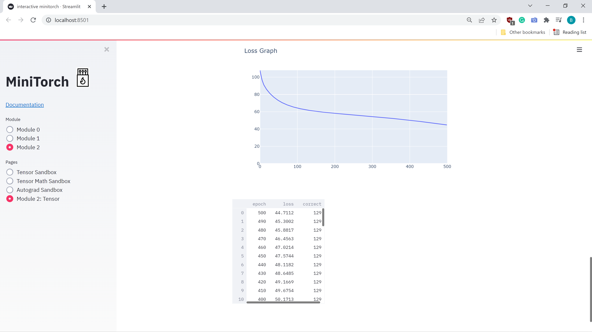
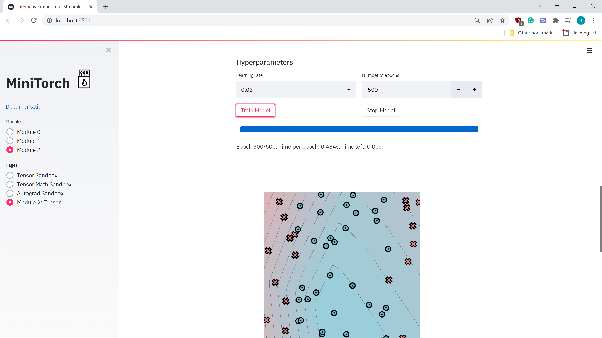
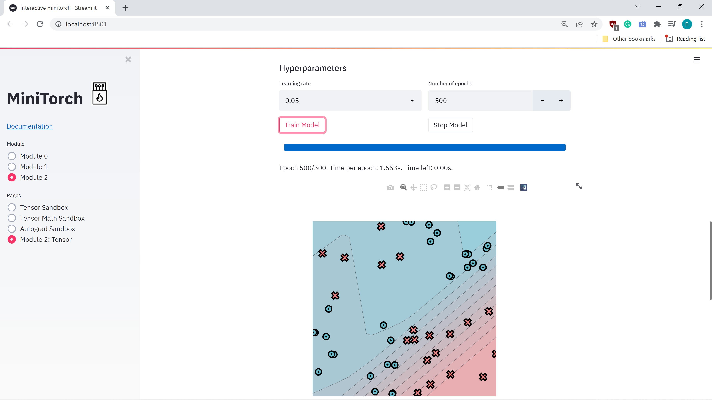
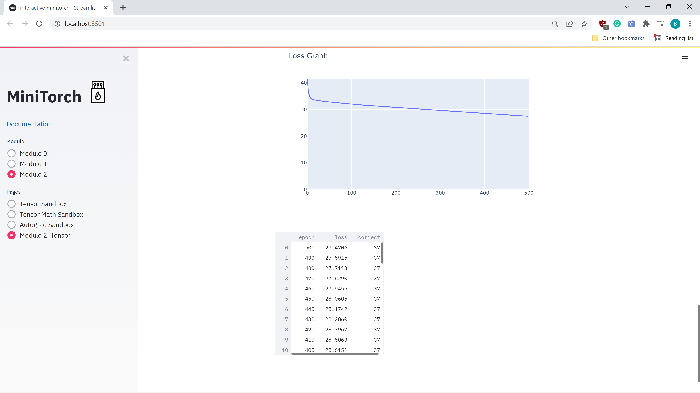

# MiniTorch Module 2

* Docs: https://minitorch.github.io/

* Overview: https://minitorch.github.io/module2.html

This assignment requires the following files from the previous assignments.

        minitorch/operators.py minitorch/module.py minitorch/autodiff.py minitorch/scalar.py project/run_manual.py project/run_scalar.py

The outputs of the traning model:

1) The output for "Simple" traning dataset. The number of hidden layers=2, learning rate-0.05, Number of epochs=500, Number of points in datasets=50.
The output logs are:

Epoch: 0/500, loss: 0, correct: 0 
time 0.13763093948364258 
Epoch: 10/500, loss: 30.335082472870216, correct: 37 
time 0.1430494785308838 
Epoch: 20/500, loss: 29.85854898179911, correct: 34 
time 0.12068629264831543 
Epoch: 30/500, loss: 29.412458017033934, correct: 33 
time 0.14066147804260254 
Epoch: 40/500, loss: 28.945357706458477, correct: 33 
time 0.12495136260986328 
Epoch: 50/500, loss: 28.43754373394967, correct: 35 
time 0.14058923721313477 
Epoch: 60/500, loss: 27.87945817964205, correct: 36 
time 0.1192328929901123 
Epoch: 70/500, loss: 27.26906423713495, correct: 38 
time 0.12726998329162598 
Epoch: 80/500, loss: 26.628048195447615, correct: 39 
time 0.12709498405456543 
Epoch: 90/500, loss: 25.933350816492705, correct: 40 
time 0.10934948921203613 
Epoch: 100/500, loss: 25.208425170434644, correct: 40 
time 0.11311626434326172 
Epoch: 110/500, loss: 24.45791661644245, correct: 40 
time 0.14059829711914062 
Epoch: 120/500, loss: 23.683156903895227, correct: 42 
time 0.1249699592590332 
Epoch: 130/500, loss: 22.875344834963958, correct: 43 
time 0.1249685287475586 
Epoch: 140/500, loss: 22.03402693563135, correct: 43 
time 0.1098780632019043 
Epoch: 150/500, loss: 21.18373851237769, correct: 44 
time 0.1250145435333252 
Epoch: 160/500, loss: 20.312483271353347, correct: 46 
time 0.12622666358947754 
Epoch: 170/500, loss: 19.440050403826593, correct: 47 
time 0.1427011489868164 
Epoch: 180/500, loss: 18.575776080861846, correct: 47 
time 0.1086583137512207 
Epoch: 190/500, loss: 17.71704138744683, correct: 48 
time 0.12389087677001953 
Epoch: 200/500, loss: 16.882491257452468, correct: 48 
time 0.12498331069946289 
Epoch: 210/500, loss: 16.091549170911897, correct: 48 
time 0.12497067451477051 
Epoch: 220/500, loss: 15.332470329022575, correct: 48 
time 0.14058566093444824 
Epoch: 230/500, loss: 14.606649736545476, correct: 48 
time 0.10934329032897949 
Epoch: 240/500, loss: 13.917327224315162, correct: 48 
time 0.10934686660766602 
Epoch: 250/500, loss: 13.274678841034312, correct: 48 
time 0.12501740455627441 
Epoch: 260/500, loss: 12.674261701922838, correct: 48 
time 0.12719392776489258 
Epoch: 270/500, loss: 12.117069028348421, correct: 48 
time 0.13365411758422852 
Epoch: 280/500, loss: 11.600601467698686, correct: 48 
time 0.12096929550170898 
Epoch: 290/500, loss: 11.234496607430268, correct: 48 
time 0.15621328353881836 
Epoch: 300/500, loss: 10.91358164586227, correct: 48 
time 0.12492990493774414 
Epoch: 310/500, loss: 10.620378161935657, correct: 48 
time 0.1562061309814453 
Epoch: 320/500, loss: 10.350445226636984, correct: 48 
time 0.12497234344482422 
Epoch: 330/500, loss: 10.094508055127667, correct: 48 
time 0.12497067451477051 
Epoch: 340/500, loss: 9.855202498803436, correct: 48 
time 0.1249704360961914 
Epoch: 350/500, loss: 9.637401164299996, correct: 48 
time 0.14058685302734375 
Epoch: 360/500, loss: 9.429901022520314, correct: 49 
time 0.12497091293334961 
Epoch: 370/500, loss: 9.231557663929635, correct: 49 
time 0.13533949851989746 
Epoch: 380/500, loss: 9.04170075197407, correct: 49 
time 0.1249704360961914 
Epoch: 390/500, loss: 8.859717449766324, correct: 49 
time 0.1249704360961914 
Epoch: 400/500, loss: 8.685045031184144, correct: 49 
time 0.13973736763000488 
Epoch: 410/500, loss: 8.517166045718012, correct: 49 
time 0.11179637908935547 
Epoch: 420/500, loss: 8.355607437548862, correct: 49 
time 0.14689993858337402 
Epoch: 430/500, loss: 8.199938648805105, correct: 49 
time 0.1093912124633789 
Epoch: 440/500, loss: 8.049769100093725, correct: 49 
time 0.12494373321533203 
Epoch: 450/500, loss: 7.904745307584958, correct: 49 
time 0.12492918968200684 
Epoch: 460/500, loss: 7.764547826084953, correct: 49 
time 0.12497544288635254 
Epoch: 470/500, loss: 7.628888157758908, correct: 49 
time 0.1405940055847168 
Epoch: 480/500, loss: 7.4975057268258265, correct: 49 
time 0.12493109703063965 
Epoch: 490/500, loss: 7.370164989340969, correct: 49 
time 0.23093295097351074 
Epoch: 500/500, loss: 7.2466527228450595, correct: 49 

The visual form of training:

The loss graph of simple model:

2) The output for "Diag" traning dataset. The number of hidden layers=5, learning rate-0.05, Number of epochs=500, Number of points in dataset=150.
The output logs:

Epoch: 0/500, loss: 0, correct: 0 
time 0.39938998222351074 
Epoch: 10/500, loss: 92.51894810899691, correct: 129 
time 0.4403657913208008 
Epoch: 20/500, loss: 85.12459490776888, correct: 129 
time 0.48703765869140625 
Epoch: 30/500, loss: 80.07446950667104, correct: 129 
time 0.4408223628997803 
Epoch: 40/500, loss: 76.15890389532024, correct: 129 
time 0.348799467086792 
Epoch: 50/500, loss: 73.05788302131292, correct: 129 
time 0.3566098213195801 
Epoch: 60/500, loss: 70.56968266837922, correct: 129 
time 0.38504528999328613 
Epoch: 70/500, loss: 68.54655319803913, correct: 129 
time 0.357759952545166 
Epoch: 80/500, loss: 66.8817897532807, correct: 129 
time 0.35758280754089355 
Epoch: 90/500, loss: 65.4967826529188, correct: 129 
time 0.36033201217651367 
Epoch: 100/500, loss: 64.3312250584349, correct: 129 
time 0.35256099700927734 
Epoch: 110/500, loss: 63.33860026508682, correct: 129 
time 0.4233231544494629 
Epoch: 120/500, loss: 62.482406684660184, correct: 129 
time 0.3753819465637207 
Epoch: 130/500, loss: 61.7348506901337, correct: 129 
time 0.36558032035827637 
Epoch: 140/500, loss: 61.072952040428035, correct: 129 
time 0.37729763984680176 
Epoch: 150/500, loss: 60.481514610703414, correct: 129 
time 0.39304637908935547 
Epoch: 160/500, loss: 59.945210900515306, correct: 129 
time 0.379439115524292 
Epoch: 170/500, loss: 59.45364720439169, correct: 129 
time 0.3570115566253662 
Epoch: 180/500, loss: 58.99622437458879, correct: 129 
time 0.38688182830810547 
Epoch: 190/500, loss: 58.56606480848727, correct: 129 
time 0.34561681747436523 
Epoch: 200/500, loss: 58.160454634710874, correct: 129 
time 0.44254064559936523 
Epoch: 210/500, loss: 57.77026503948096, correct: 129 
time 0.35704922676086426 
Epoch: 220/500, loss: 57.390895243406, correct: 129 
time 0.35370469093322754 
Epoch: 230/500, loss: 57.02033520112067, correct: 129 
time 0.3511950969696045 
Epoch: 240/500, loss: 56.659331918335326, correct: 129 
time 0.3690767288208008 
Epoch: 250/500, loss: 56.30186696018683, correct: 129 
time 0.3628551959991455 
Epoch: 260/500, loss: 55.9444760764054, correct: 129 
time 0.33525896072387695 
Epoch: 270/500, loss: 55.58465555372806, correct: 129 
time 0.3654947280883789 
Epoch: 280/500, loss: 55.22077471274675, correct: 129 
time 0.35991573333740234 
Epoch: 290/500, loss: 54.85085471218477, correct: 129 
time 0.4529447555541992 
Epoch: 300/500, loss: 54.47357350768008, correct: 129 
time 0.3713955879211426 
Epoch: 310/500, loss: 54.087745215750154, correct: 129 
time 0.3401343822479248 
Epoch: 320/500, loss: 53.69575466544208, correct: 129 
time 0.34652018547058105 
Epoch: 330/500, loss: 53.29506093901414, correct: 129 
time 0.38597607612609863 
Epoch: 340/500, loss: 52.88329737684693, correct: 129 
time 0.36941075325012207 
Epoch: 350/500, loss: 52.45965871530057, correct: 129 
time 0.5318613052368164 
Epoch: 360/500, loss: 52.024030940080436, correct: 129 
time 0.7732799053192139 
Epoch: 370/500, loss: 51.57985149349668, correct: 129 
time 0.4964442253112793 
Epoch: 380/500, loss: 51.123331470770616, correct: 129 
time 0.38317036628723145 
Epoch: 390/500, loss: 50.65389201011406, correct: 129 
time 0.4059004783630371 
Epoch: 400/500, loss: 50.17129897871555, correct: 129 
time 0.39111876487731934 
Epoch: 410/500, loss: 49.675366666505916, correct: 129 
time 0.39908933639526367 
Epoch: 420/500, loss: 49.166913400004745, correct: 129 
time 0.374908447265625 
Epoch: 430/500, loss: 48.648453011295665, correct: 129 
time 0.42490077018737793 
Epoch: 440/500, loss: 48.118208456678374, correct: 129 
time 0.3888275623321533 
Epoch: 450/500, loss: 47.574405476348616, correct: 129 
time 0.5626790523529053 
Epoch: 460/500, loss: 47.021435293090896, correct: 129 
time 0.525667667388916 
Epoch: 470/500, loss: 46.45630111502969, correct: 129 
time 0.42994022369384766 
Epoch: 480/500, loss: 45.88167543077808, correct: 129 
time 0.41776084899902344 
Epoch: 490/500, loss: 45.30017487662325, correct: 129 
time 0.3780558109283447 
Epoch: 500/500, loss: 44.71123080445065, correct: 129 

The visual form of training:

The loss graph of simple model:

3) The output for "Split" traning dataset. The number of hidden layers=5, learning rate-0.05, Number of epochs=500, Number of points in dataset=50.
The output logs:

Epoch: 0/500, loss: 0, correct: 0 
Epoch: 0/500, loss: 0, correct: 0 
Epoch: 0/500, loss: 0, correct: 0 
time 0.37821531295776367 
Epoch: 10/500, loss: 34.87151718184139, correct: 27 
time 0.39011120796203613 
Epoch: 20/500, loss: 32.6877196209469, correct: 33 
time 0.45362329483032227 
Epoch: 30/500, loss: 32.362042844344636, correct: 32 
time 0.40209484100341797 
Epoch: 40/500, loss: 32.25153452314534, correct: 32 
time 0.388974666595459 
Epoch: 50/500, loss: 32.177065029428405, correct: 32 
time 0.4286339282989502 
Epoch: 60/500, loss: 32.020765937909054, correct: 32 
time 0.4349853992462158 
Epoch: 70/500, loss: 31.909676953987827, correct: 32 
time 0.4064371585845947 
Epoch: 80/500, loss: 31.820901498575623, correct: 32 
time 0.40705299377441406 
Epoch: 90/500, loss: 31.73979746345453, correct: 32 
time 0.40010666847229004 
Epoch: 100/500, loss: 31.679713180462446, correct: 32 
time 0.46717047691345215 
Epoch: 110/500, loss: 31.629437634801594, correct: 32 
time 0.41778039932250977 
Epoch: 120/500, loss: 31.58042265833473, correct: 32 
time 0.40590786933898926 
Epoch: 130/500, loss: 31.53279489328405, correct: 32 
time 0.41162872314453125 
Epoch: 140/500, loss: 31.483052840392176, correct: 32 
time 0.4007914066314697 
Epoch: 150/500, loss: 31.430974979658064, correct: 32 
time 0.4138362407684326 
Epoch: 160/500, loss: 31.37660794785013, correct: 32 
time 0.4005100727081299 
Epoch: 170/500, loss: 31.31977967886018, correct: 32 
time 0.41735219955444336 
Epoch: 180/500, loss: 31.260199815891795, correct: 32 
time 0.39969778060913086 
Epoch: 190/500, loss: 31.19754138927261, correct: 32 
time 0.4092550277709961 
Epoch: 200/500, loss: 31.1318391781908, correct: 32 
time 0.4018890857696533 
Epoch: 210/500, loss: 31.06448217418301, correct: 32 
time 0.39761948585510254 
Epoch: 220/500, loss: 30.99501238849359, correct: 32 
time 0.41240501403808594 
Epoch: 230/500, loss: 30.92298556195884, correct: 32 
time 0.39513063430786133 
Epoch: 240/500, loss: 30.848077616144828, correct: 33 
time 0.4026002883911133 
Epoch: 250/500, loss: 30.770222949550405, correct: 33 
time 0.42319416999816895 
Epoch: 260/500, loss: 30.691079886491202, correct: 33 
time 0.3812904357910156 
Epoch: 270/500, loss: 30.609214912345784, correct: 33 
time 0.36653709411621094 
Epoch: 280/500, loss: 30.524048465360643, correct: 33 
time 0.41578245162963867 
Epoch: 290/500, loss: 30.43535301040136, correct: 33 
time 0.3799448013305664 
Epoch: 300/500, loss: 30.3436946921005, correct: 33 
time 0.3703770637512207 
Epoch: 310/500, loss: 30.24972531824092, correct: 33 
time 0.3798196315765381 
Epoch: 320/500, loss: 30.152456711961896, correct: 33 
time 0.4206812381744385 
Epoch: 330/500, loss: 30.04756153502186, correct: 33 
time 0.3609740734100342 
Epoch: 340/500, loss: 29.931495482306538, correct: 34 
time 0.40000247955322266 
Epoch: 350/500, loss: 29.81066666086451, correct: 34 
time 0.4220468997955322 
Epoch: 360/500, loss: 29.687457145927137, correct: 34 
time 0.39078617095947266 
Epoch: 370/500, loss: 29.557961213618245, correct: 34 
time 0.3886864185333252 
Epoch: 380/500, loss: 29.428263289667967, correct: 34 
time 0.405153751373291 
Epoch: 390/500, loss: 29.298888489596116, correct: 35 
time 0.3991711139678955 
Epoch: 400/500, loss: 29.165263885200133, correct: 35 
time 0.3676888942718506 
Epoch: 410/500, loss: 29.02756215789042, correct: 35 
time 0.3833763599395752 
Epoch: 420/500, loss: 28.88667719746322, correct: 34 
time 0.4278249740600586 
Epoch: 430/500, loss: 28.74197332712019, correct: 34 
time 0.37117886543273926 
Epoch: 440/500, loss: 28.59030825006014, correct: 34 
time 0.3865950107574463 
Epoch: 450/500, loss: 28.432258262754566, correct: 34 
time 0.36961793899536133 
Epoch: 460/500, loss: 28.269347966811086, correct: 35 
time 0.40920138359069824 
Epoch: 470/500, loss: 28.10264827414844, correct: 35 
time 0.38044142723083496 
Epoch: 480/500, loss: 27.906621761912806, correct: 35 
time 0.3808422088623047 
Epoch: 490/500, loss: 27.68940270767879, correct: 35 
time 0.3701939582824707 
Epoch: 500/500, loss: 27.478302867201677, correct: 35 

The visual form of training:

The loss graph of simple model:

4) The output for "Xor" traning dataset. The number of hidden layers=10, learning rate-0.05, Number of epochs=650, Number of points in dataset=50.
The output logs:

Epoch: 0/500, loss: 0, correct: 0 
Epoch: 0/500, loss: 0, correct: 0 
time 1.2639422416687012 
Epoch: 10/500, loss: 34.02243922122097, correct: 20 
time 1.2236952781677246 
Epoch: 20/500, loss: 33.51363740416737, correct: 20 
time 1.208653211593628 
Epoch: 30/500, loss: 33.26086946686713, correct: 20 
time 1.23722243309021 
Epoch: 40/500, loss: 33.04681252314288, correct: 22 
time 1.1682496070861816 
Epoch: 50/500, loss: 32.861920343115024, correct: 24 
time 1.169532060623169 
Epoch: 60/500, loss: 32.68728082095664, correct: 25 
time 1.2199831008911133 
Epoch: 70/500, loss: 32.52544468500711, correct: 27 
time 1.1919519901275635 
Epoch: 80/500, loss: 32.366272319827885, correct: 27 
time 1.1637017726898193 
Epoch: 90/500, loss: 32.20881714079203, correct: 27 
time 1.1769990921020508 
Epoch: 100/500, loss: 32.05239081213041, correct: 27 
time 1.4657213687896729 
Epoch: 110/500, loss: 31.897933123654376, correct: 29 
time 1.1990768909454346 
Epoch: 120/500, loss: 31.759465195747886, correct: 30 
time 1.7737879753112793 
Epoch: 130/500, loss: 31.634126800551886, correct: 30 
time 1.1599643230438232 
Epoch: 140/500, loss: 31.511916277008183, correct: 30 
time 1.1197295188903809 
Epoch: 150/500, loss: 31.396584355270885, correct: 31 
time 1.3207967281341553 
Epoch: 160/500, loss: 31.28262318529291, correct: 32 
time 1.1629178524017334 
Epoch: 170/500, loss: 31.170613947087638, correct: 32 
time 1.2052791118621826 
Epoch: 180/500, loss: 31.063028772807915, correct: 32 
time 1.1151399612426758 
Epoch: 190/500, loss: 30.956740043991264, correct: 32 
time 1.1576972007751465 
Epoch: 200/500, loss: 30.84396080565229, correct: 32 
time 1.2112762928009033 
Epoch: 210/500, loss: 30.731220077426126, correct: 32 
time 1.1916239261627197 
Epoch: 220/500, loss: 30.61030523710488, correct: 32 
time 1.1920135021209717 
Epoch: 230/500, loss: 30.486662096462744, correct: 32 
time 1.2523319721221924 
Epoch: 240/500, loss: 30.352703158112813, correct: 32 
time 1.2221672534942627 
Epoch: 250/500, loss: 30.23872539267999, correct: 33 
time 1.2255735397338867 
Epoch: 260/500, loss: 30.128254973400423, correct: 33 
time 1.2778866291046143 
Epoch: 270/500, loss: 30.01724421510394, correct: 34 
time 1.2904434204101562 
Epoch: 280/500, loss: 29.905224293531656, correct: 35 
time 1.3152246475219727 
Epoch: 290/500, loss: 29.794253926144723, correct: 36 
time 1.3220837116241455 
Epoch: 300/500, loss: 29.684314777564154, correct: 36 
time 1.3169043064117432 
Epoch: 310/500, loss: 29.576809324146527, correct: 36 
time 1.331395149230957 
Epoch: 320/500, loss: 29.47064788771237, correct: 36 
time 1.3491714000701904 
Epoch: 330/500, loss: 29.363626849870858, correct: 36 
time 1.31636381149292 
Epoch: 340/500, loss: 29.257854078208346, correct: 36 
time 1.394965648651123 
Epoch: 350/500, loss: 29.151345909115445, correct: 37 
time 1.3215689659118652 
Epoch: 360/500, loss: 29.04444148557539, correct: 37 
time 1.3091645240783691 
Epoch: 370/500, loss: 28.93668485342338, correct: 37 
time 1.2509393692016602 
Epoch: 380/500, loss: 28.829925004237133, correct: 37 
time 1.5958056449890137 
Epoch: 390/500, loss: 28.72311539476614, correct: 37 
time 1.5439960956573486 
Epoch: 400/500, loss: 28.615125913836795, correct: 37 
time 1.2923238277435303 
Epoch: 410/500, loss: 28.506275567369386, correct: 37 
time 1.712322473526001 
Epoch: 420/500, loss: 28.396723293344326, correct: 37 
time 1.2940871715545654 
Epoch: 430/500, loss: 28.2860492472598, correct: 37 
time 1.4512789249420166 
Epoch: 440/500, loss: 28.17417695441098, correct: 37 
time 1.481048822402954 
Epoch: 450/500, loss: 28.060502059275546, correct: 37 
time 1.4319756031036377 
Epoch: 460/500, loss: 27.945588287437086, correct: 37 
time 1.4193155765533447 
Epoch: 470/500, loss: 27.828980945117234, correct: 37 
time 1.475170612335205 
Epoch: 480/500, loss: 27.711268290041343, correct: 37 
time 1.3895668983459473 
Epoch: 490/500, loss: 27.591530945624587, correct: 37 
time 1.5001378059387207 
Epoch: 500/500, loss: 27.470609803663738, correct: 37 

The visual form of training:

The loss graph of simple model:

